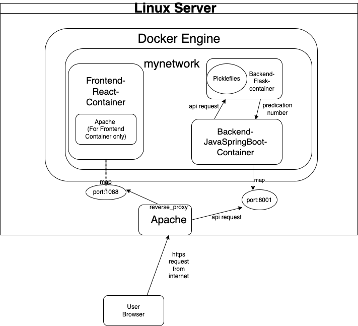

## Tourify
  
Temporarily hosted on UCD servers: https://csi6220-2-vm1.ucd.ie/

### Abstract
Exploring a new city, particularly one as diverse and vibrant as Manhattan can be a daunting task for tourists. They often grapple with challenges like navigating unfamiliar attractions, gauging crowd density, and lacking personalised travel recommendations. Such issues can detract from their overall experience and potentially hinder willingness to travel and explore more. To address these issues our development team has created a dynamic single-page web application that we are naming Tourify. By combining the interactivity of React on the frontend, the robustness of Spring Boot for our backend, and integrating machine learning models we developed a holistic solution aimed at simplifying the exploration of Manhattan. Our application offers features such as real-time route planning, geolocation-based check-ins at tourist attractions and an innovative Non-Fungible Token (NFT) minting feature tied to user check-ins. In addition to this our machine learning models predict the level of activity at tourist attractions which empowers users to plan their journeys strategically and avoid crowded locations. By addressing the common challenges faced by tourists when navigating a new city our web application not only elevates the travel experience but also showcases the successful fusion of technology and user-centric design. The result is an innovative platform that revolutionises the way tourists engage with and immerse themselves in Manhattan's cultural and architectural richness. The application is built using a modern technology stack and architecture that is scalable and could be expanded to other cities across the globe elevating the travel experience of an international user base.

### Features
* Creating user accounts using Google OAuth
* Real-time busyness predictions for our curated list of attractions in Manhattan
* Route Planning for users to get real-time directions
* Geo-location based Check-ins at tourist attractions
* Rewards for Check-ins that include Badges and a unique minted NFTs sent to their wallet address
* Real-time weather display updates in Manhattan
* A recommender for users to see the nearest and least busy attractions
* Ability to change the users NFT wallet address
* Ability to delete their accounts and all user data hosted on our servers
* Ability to provide user feedback to be fed back into the Machine Learning model to improve the predictions
* A helping starting guide with attached screenshots for how to use each feature on the application
  
### Machine Learning
This folder contains the code for a Flask API that predicts the demand for taxis in different zones based on input parameters. It uses pre-trained Random Forest models that are loaded from pickle files.
  
#### models.py
This file contains the code to load the pre-trained Random Forest models from pickle files. The models are stored in a dictionary called `models`, where the keys are the taxi location IDs and the values are the corresponding loaded models. The pickle files for the models are located in the `pickle_files` directory.

##### api_ml.py
This file defines the Flask API endpoints for receiving prediction requests. It loads the models from the `models.py` file and uses them to make predictions based on the input parameters received in the JSON payload. The API endpoint `/predict` expects a POST request with the input parameters in JSON format. The predicted demand is returned as a JSON response.
The API applies rounding to the prediction value and ensures that it does not exceed 100. 

##### pickle_files
This directory contains the pre-trained Random Forest models saved as pickle files. Each pickle file corresponds to a specific taxi location ID and is loaded by the `models.py` file.

### Linux Server Architecture Diagram

### Project Tech Stack & Architecture 

  
## Datasets
  
* [MTA Subway Hourly Ridership](https://data.ny.gov/Transportation/MTA-Subway-Hourly-Ridership-Beginning-February-202/wujg-7c2s)  
* [TLC Trip Record Data](https://www.nyc.gov/site/tlc/about/tlc-trip-record-data.page)  
* [Uber NYC for-hire vehicles trip data (2021)](https://www.kaggle.com/datasets/shuhengmo/uber-nyc-forhire-vehicles-trip-data-2021)  
* [Free historical weather data (table per month)](https://www.wunderground.com/history/monthly/us/ny/new-york-city/)
  
We also curated our own datasets, such as a list of major attractions in Manhattan and a relational table that links the closest subway station to a taxi zone in the taxi data that the [nyc.gov](https://www.nyc.gov/site/tlc/about/tlc-trip-record-data.page) releases:
  
  | Name                           | Station Complex ID                                              |
|--------------------------------|-----------------------------------------------------------------|
| Empire State Building          | \'34 St-Penn Station (A,C,E)\', \'34 St-Penn Station (1,2,3)\'      |
| Statue of Liberty             | \'South Ferry (1)/Whitehall St (R,W)\', \'Bowling Green (4,5)\'     |
| Brooklyn Bridge               | -                                                               |
| Metropolitan Museum of Art    | \'86 St (4,5,6)\'                                                 |
| Museum of Modern Art (MoMA)   | \'47-50 Sts-Rockefeller Center (B,D,F,M)\'                        |
| Guggenheim Museum             | \'Lexington Av-53 St (E,M)/51 St (6)\'                            |
| Central Park                  | \'59 St-Columbus Circle (A,B,C,D,1)\'                             |
| Bryant Park                   | \'47-50 Sts-Rockefeller Center (B,D,F,M)\'                        |
| (repeat)                      |                                                                 |
| High Line                     | \'Canarsie-Rockaway Pkwy (L)\'                                    |
| Broadway                      | \'Broadway (N,W)\', \'163 St-Amsterdam Av (C)\'                     |
| Radio City Music Hall         | \'50 St (D)\', \'49 St (N,R,W)\', \'47-50 Sts-Rockefeller Center\'   |
| (repeat)                      | \(B,D,F,M)\'                                                      |
| Lincoln Center                | \'66 St-Lincoln Center (1)\'                                      |
| Greenwich Village             | \'34 St-Hudson Yards (7)\'                                        |
| Harlem                        | \'Central Park North-110 St (2,3)\'                               |
| Eataly                        | \'23 St (1)\'                                                     |
| Grand Central Market          | \'Grand Central-42 St (S,4,5,6,7)\'                               |
| Whitney Museum                | \'14 St-Union Sq (L,N,Q,R,W,4,5,6)\'                              |
| Museum of Arts and Design     | \'59 St-Columbus Circle (A,B,C,D,1)\'                             |
| New Museum                    | ‘Houston St (1)’, ‘2 Av (F)\'                                    |
| Morgan Library & Museum       | \'Grand Central-42 St (S,4,5,6,7)\'                               |
| Trinity Church                | \'Canal St (J,N,Q,R,W,Z,6)\'                                      |
| Fraunces Tavern               | \'South Ferry (1)/Whitehall St (R,W)\'                            |

  
## How to Run Tourify Locally:

- refer to Linux Server Architecture Diagram above when you want to run Tourify locally 

Here are the steps to properly run the application:
- download docker engine 
- create a network named tourify within docker engine and indicate the network's subnet(172.18.0.0/16)( as to fix ML container's ip address)
- get a ssl cert for your localhost to support google-login function
- change the host name of each api request to localhost 

#### Frontend container: 
- add .env file which contains the necessary api key in frontend folder
- run npm install && npm run build on IDE and get the build folder
- upload the build folder and frontend dockerfile to docker engine
- build docker image 
- run docker container under the tourify network, map the docker port to a linux port if needed
- edit the coop policy in frontend Apache configuration file to allow pop-up window if the google-login function is blocked by your browser
- restart container after apache editing

#### Backend container: 
- upload .jar file and backend dockerfile to docker engine
- build docker image 
- run docker container under the tourify network, map the docker port to a linux port if needed

#### ML container: 
- upload the whole ML folder include model, flask file and requirement.txt and ML dockerfile to docker engine
- build docker image 
- run docker container under the tourify network, map the docker port to a linux port if needed
- allocate ip :172.18.0.3 manually for ML container when run ML container 

